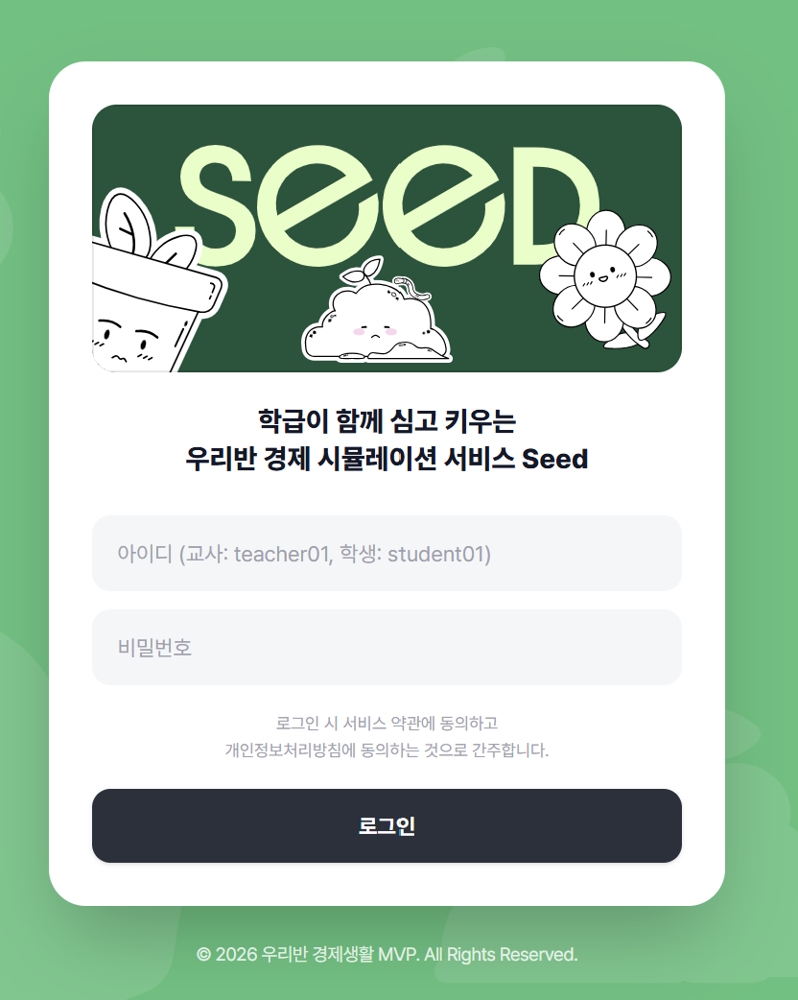
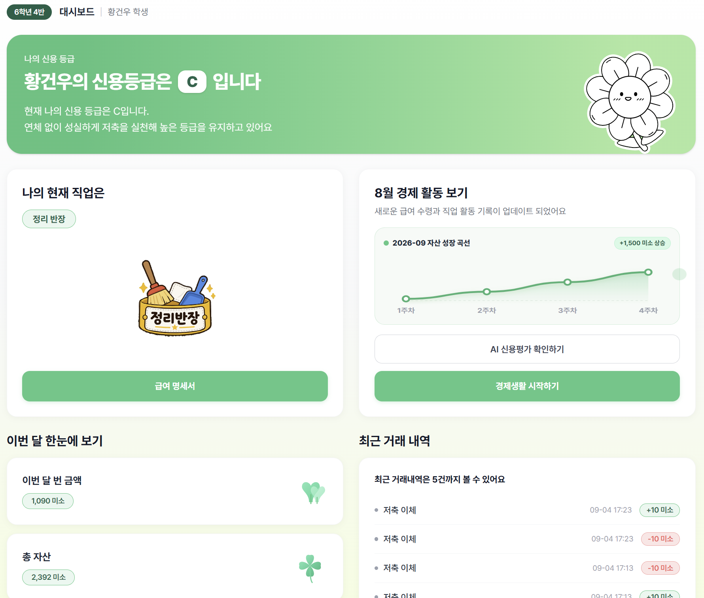
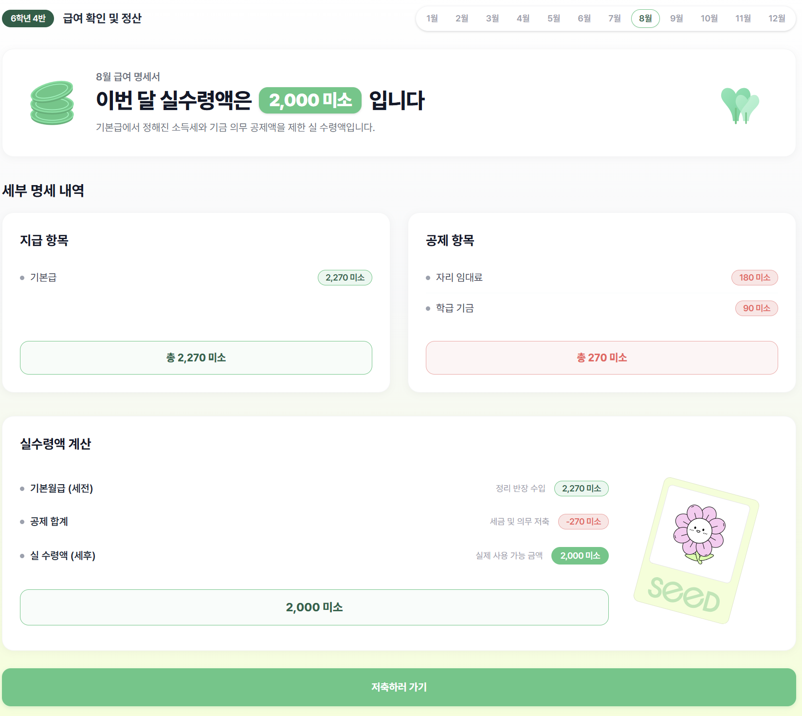
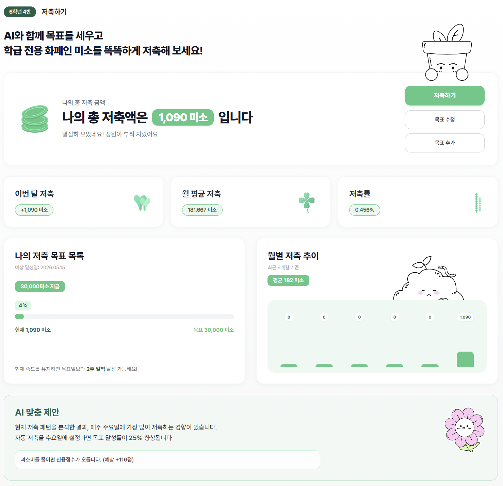
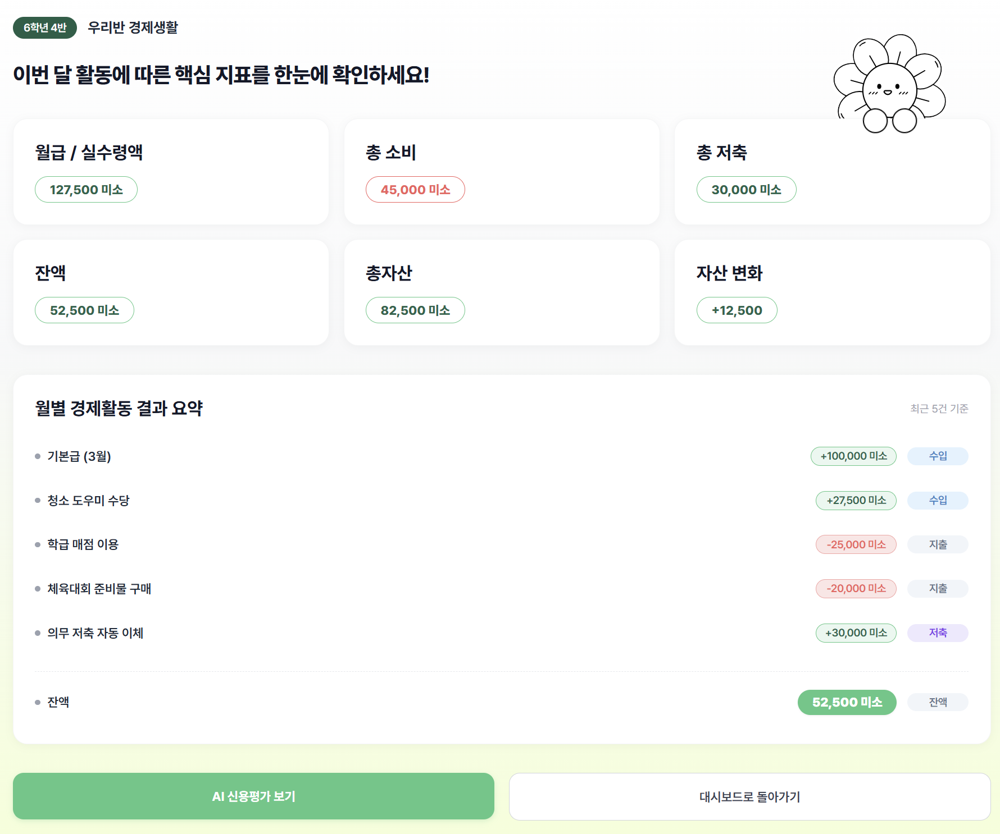
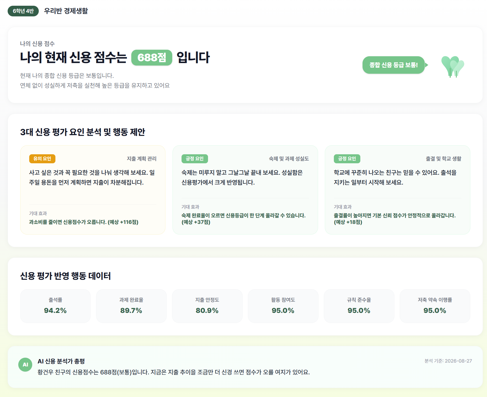
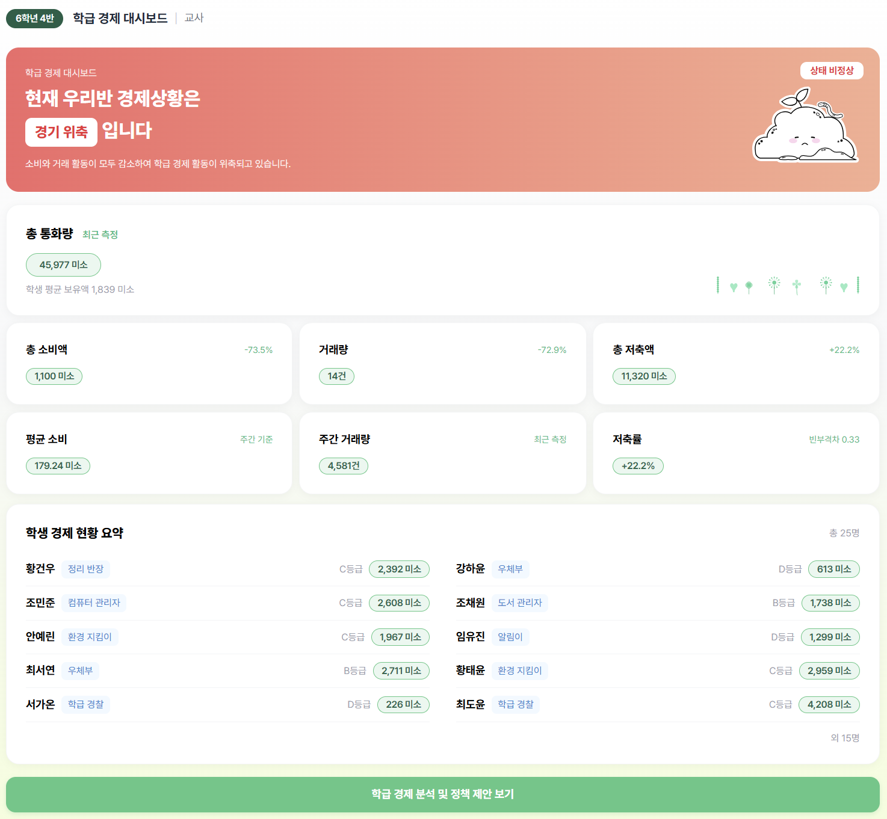
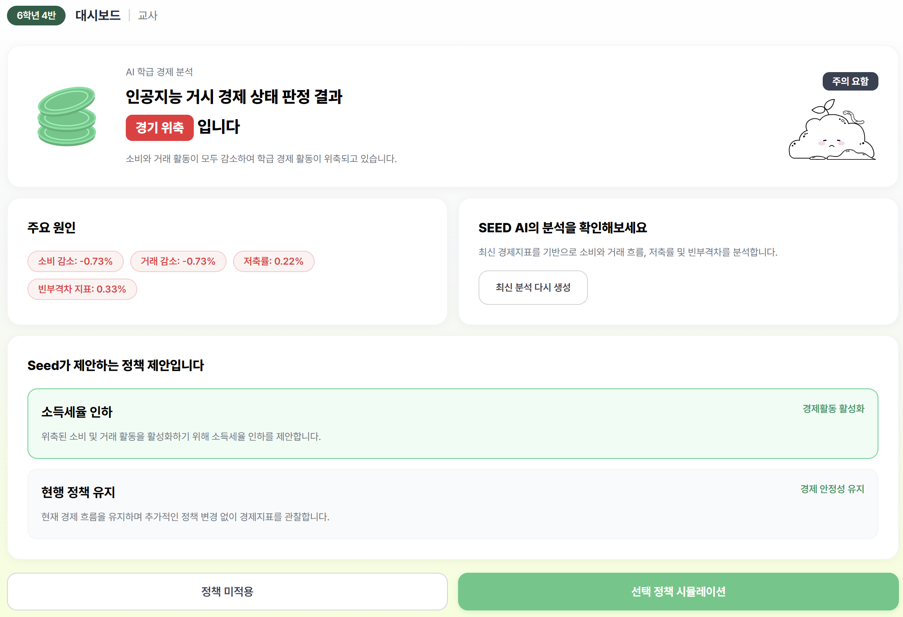
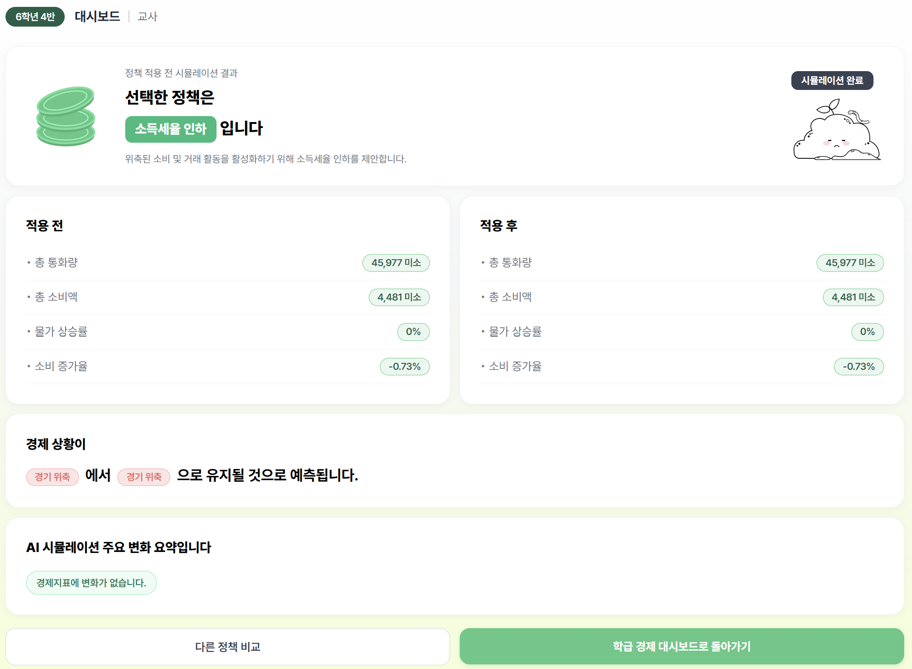

# SEED Frontend

<div align="center">


</div>

> **AI와 함께 배우는 우리 반 경제생활, SEED**
>
> **개발기간: 2026.08 ~**

## 배포 주소

- **로컬 개발**: [http://localhost:3000](http://localhost:3000)
- **프론트 서버**: [frontend-xi-three-61.vercel.app](https://frontend-xi-three-61.vercel.app)

---

## 프로젝트 소개

SEED는 학생이 학급 전용 화폐인 **미소**로 소득·소비·저축을 경험하고, AI 분석을 통해 자신의 경제 습관을 돌아보는 금융 교육 서비스입니다.

학생은 월급과 자산, 저축 목표, 신용평가 결과를 확인하고, 교사는 학급 전체의 경제 현황을 살펴보며 AI가 제안한 정책의 효과를 시뮬레이션할 수 있습니다.

이 저장소는 **학생·교사용 프론트엔드**를 관리합니다. Next.js App Router와 TypeScript를 기반으로 구성하며, 서버 상태는 TanStack Query, 공유 클라이언트 상태는 Zustand로 관리합니다. 스타일링에는 Tailwind CSS를 사용합니다.

---

## 시작 가이드

### Requirements

- Node.js **20.9 이상** (현재 Next.js 패키지 기준)
- npm
- 로그인과 데이터 조회를 위한 백엔드 서버 및 학생·교사 계정

### Installation

저장소를 내려받은 뒤 프로젝트 루트에서 실행합니다.

```bash
npm ci
```

루트에 `.env.local`을 만들고 백엔드 주소를 설정합니다. `.env.example`의 `예시` 값은 실제 주소로 교체해야 합니다.

```env
NEXT_PUBLIC_API_BASE_URL=http://localhost:8080
```

```bash
npm run dev
```

[http://localhost:3000](http://localhost:3000)에 접속해 로그인합니다. 로그인한 계정의 역할에 따라 학생 또는 교사 대시보드로 이동합니다.

---

## Scripts

```bash
npm run dev           # 개발 서버 실행
npm run build         # 프로덕션 빌드
npm run start         # 빌드된 프로덕션 서버 실행
npm run lint          # ESLint 검사
npm run format        # Prettier 포맷팅
npm run format:check  # Prettier 규칙 준수 여부 확인
```

---

## Stacks 🔨

### Environment


### Config


### Development


### Deployment


### Communication


---

## 화면 구성 📺

이미지를 클릭하면 원본 크기로 확인할 수 있습니다.

### 공통 로그인

<p align="center">
  <a href="public/images/readme/login.png"></a>
</p>

### 학생 화면

<table>
  <tr>
    <td width="33%" align="center" valign="top">
      <strong>학생 대시보드</strong><br><br>
      <a href="public/images/readme/student-dashboard.png"></a>
    </td>
    <td width="33%" align="center" valign="top">
      <strong>급여 확인 및 정산</strong><br><br>
      <a href="public/images/readme/student-payroll.png"></a>
    </td>
    <td width="33%" align="center" valign="top">
      <strong>저축 목표 및 현황</strong><br><br>
      <a href="public/images/readme/student-savings.png"></a>
    </td>
  </tr>
  <tr>
    <td width="33%" align="center" valign="top">
      <strong>월별 경제생활 리포트</strong><br><br>
      <a href="public/images/readme/student-monthly-report.png"></a>
    </td>
    <td width="33%" align="center" valign="top">
      <strong>AI 신용평가</strong><br><br>
      <a href="public/images/readme/student-credit-evaluation.png"></a>
    </td>
  </tr>
</table>

### 교사 화면

<table>
  <tr>
    <td width="33%" align="center" valign="top">
      <strong>교사 학급 경제 대시보드</strong><br><br>
      <a href="public/images/readme/teacher-dashboard.png"></a>
    </td>
    <td width="33%" align="center" valign="top">
      <strong>AI 경제 분석 및 정책 제안</strong><br><br>
      <a href="public/images/readme/teacher-policy.png"></a>
    </td>
    <td width="33%" align="center" valign="top">
      <strong>정책 시뮬레이션 결과</strong><br><br>
      <a href="public/images/readme/teacher-policy-result.png"></a>
    </td>
  </tr>
</table>

---

## 주요 기능 📦

### 학생의 경제생활

- **경제 현황 조회**: 자산, 수입·지출, 저축 및 신용등급을 대시보드에서 확인합니다.
- **월급 명세서**: 선택한 월의 급여와 세금·의무 저축 등 공제 내역을 확인합니다.
- **저축과 계좌 관리**: 저축 목표 및 추이를 조회하고, 계좌 간 저축 이체와 거래 내역 조회를 제공합니다.
- **월별 리포트와 AI 신용평가**: 월별 경제활동 결과, 신용점수·등급, 평가 요인과 행동 제안을 확인합니다.

### 교사의 학급 경제 운영

- **학급 경제 대시보드**: 학급 경제 지표와 학생별 경제 현황을 조회합니다.
- **AI 경제 분석**: 최신 경제 분석을 조회하거나 새 분석을 요청합니다.
- **정책 제안과 시뮬레이션**: 정책을 선택하고 적용 전 예상 지표 변화와 AI 요약을 확인합니다.

### 인증 및 접근 제어

- 학생·교사 계정 로그인과 로그아웃을 지원합니다.
- `AuthGuard`로 로그인 상태와 역할을 확인하고 각 역할의 화면으로 안내합니다.
- API 요청에 인증 토큰을 첨부하며, 인증 만료 응답을 받으면 로그인 화면으로 이동합니다.

> 현재 MVP 구현 기준입니다. 주요 데이터는 백엔드 API와 연동하며, 일부 안내 문구·차트·보조 지표에는 예시 값이 남아 있습니다. AI 분석과 평가 결과를 확인하려면 백엔드에 해당 데이터가 준비되어 있어야 합니다.

---

## 프론트엔드 아키텍처 🏗️

### 구조

`app`은 라우팅과 페이지 조합을, `features`는 도메인별 API·타입·조회 및 변경 Hook을 담당합니다. 공통 UI, 레이아웃, 인증 컴포넌트는 `components`에서 관리합니다.

학생과 교사 화면은 `(student)`, `(teacher)` Route Group으로 나누고 각각의 레이아웃과 접근 제어를 적용합니다.

### Data Flow

```text
Page / Component
       ↓
TanStack Query Hook
       ↓
Feature API
       ↓
Common Fetcher (lib/api/fetcher.ts)
       ↓
Next.js /api 프록시 (브라우저 요청)
       ↓
Backend API
```

공통 Fetcher는 인증 헤더, 응답 파싱, 오류 처리와 요청 시간 제한을 담당합니다. 브라우저에서는 같은 출처의 `/api/...`로 요청하며, `app/api/[...path]/route.ts`와 `next.config.ts`에 백엔드 전달 설정이 있습니다.

---

## State Management

### TanStack Query

대시보드, 급여, 계좌·거래 내역, 저축, 신용평가, 학급 경제 분석 등 서버 데이터를 조회하고 캐싱합니다. 변경 요청은 Mutation Hook으로 관리하며, 공통 Query 설정은 `app/providers.tsx`에서 정의합니다.

### Zustand

- `useAuthStore`: 로그인 상태, 사용자 정보, 인증 토큰
- `useMonthStore`: 화면에서 선택한 조회 연도와 월
- `useSavingsStore`: 저축 / 내 통장 탭 선택
- `useStudentStore`: 학생 프로필과 대시보드에서 반영한 요약 정보
- `useTeacherStore`: 선택한 정책과 시뮬레이션 결과

### React Local State

모달 열림 여부, 입력값, 온보딩 단계처럼 개별 화면 안에서 사용하는 UI 상태는 `useState`로 관리합니다.

---

## Server / Client Components

루트 레이아웃과 로그인 진입 페이지는 Server Component로 구성합니다. 조회 Hook, Zustand, 이벤트 처리와 브라우저 API가 필요한 대시보드 및 상호작용 화면에는 `'use client'`를 사용합니다.

---

## 디렉토리 구조 📁

```text
├── app/
│   ├── (student)/           # 학생 레이아웃 및 페이지
│   │   ├── dashboard/
│   │   ├── payroll/
│   │   ├── savings/
│   │   └── credit-report/   # 월별 리포트 및 evaluation/
│   ├── (teacher)/teacher/  # 교사 dashboard/, policy/, policy/result/
│   ├── api/[...path]/      # 백엔드 API 프록시
│   ├── onboarding/
│   ├── globals.css
│   ├── layout.tsx
│   ├── page.tsx            # 로그인 진입 페이지
│   └── providers.tsx       # Query Provider 및 인증 상태 복원
├── components/
│   ├── auth/              # AuthGuard
│   ├── common/            # 공통 그래픽
│   ├── layout/            # 역할별 사이드바, 헤더, 프로필 메뉴
│   └── ui/                # 버튼, 카드, 배지 등
├── features/
│   ├── account/
│   ├── auth/
│   ├── credit/
│   ├── dashboard/
│   ├── monthly-results/
│   ├── payroll/
│   ├── savings/
│   ├── teacher/
│   └── transaction/
├── lib/
│   ├── api/fetcher.ts
│   └── auth-storage.ts
├── stores/                # Zustand Store
├── public/                # 이미지, 배경, 아이콘 등 정적 리소스
├── .env.example
├── next.config.ts
└── package.json
```

각 도메인의 코드는 필요에 따라 `api.ts`, `types.ts`, `hooks/`, `components/`로 구성합니다.

---

## Environment Variables

로컬 환경에서는 프로젝트 루트의 `.env.local`을 사용합니다.

```env
# 백엔드 서버의 기본 주소
NEXT_PUBLIC_API_BASE_URL=http://localhost:8080

# 서버 프록시용 별도 설정이 필요한 경우 사용 (선택)
# API_BASE_URL=http://localhost:8080
```

- `NEXT_PUBLIC_API_BASE_URL`: 공통 Fetcher와 백엔드 전달 설정에서 사용하는 주소입니다.
- `API_BASE_URL`: 서버 프록시용 주소입니다. 두 변수를 함께 설정할 때는 같은 백엔드를 가리키도록 설정합니다. Route Handler는 `API_BASE_URL`을, rewrites는 `NEXT_PUBLIC_API_BASE_URL`을 우선 사용합니다.
- 두 값이 없으면 프록시의 백엔드 주소는 `http://localhost:8080`으로 설정됩니다.
- 환경변수를 변경한 뒤에는 개발 서버를 다시 실행합니다.

---

## Deployment 🚀

프론트엔드는 Vercel을 통해 배포합니다.

- **빌드 명령**: `npm run build`
- **환경변수**: 배포 환경에 맞는 백엔드 주소 설정
- **백엔드 연결**: Vercel 서버에서 접근할 수 있는 백엔드 주소 필요

로컬에서 프로덕션 빌드를 확인하려면 다음 명령을 실행합니다.

```bash
npm run build
npm run start
```
